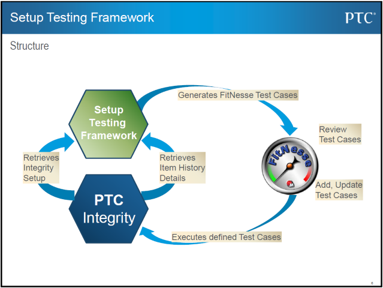

# IntegritySTeF
Functional Setup Testing Framework for PTC Integrity

It uses Fitnesse, a Java Wiki for the test execution.

## Overview

## Documentation

See Folder "doc" for details in PDF and PPT

## Use Cases
- Any action within Integrity W&D, such as:
- Document Creation
- Item Creation
- Test Session preparation
- Test execution
- Trigger tests
- Field tests

##  Development environment
- PTC Integrity LM 10.9 (also 11.0 should be fine)
- Netbeans 7.4 (or 8)
- Java 1.7 (or 1.8)
- Fitnesse framework

## Test Writing
- Manually
- or generated using a Test Case Generator (included)

## Test Execution
- Semi automated or fully automated

## Package Content / File overview
- t.b.d.

## Tested with
- t.b.d.

## Inside the files
- t.b.d.
